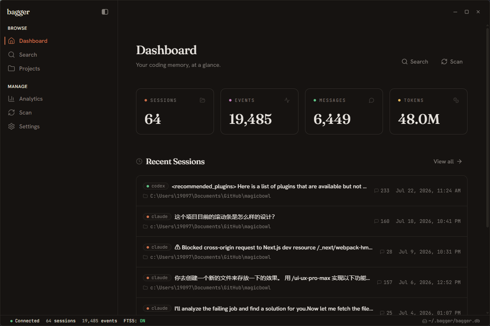

# bagger

> A local memory layer for AI coding agents.

bagger imports local coding-agent transcripts into a searchable SQLite database, then lets you browse, replay, export, and distill that history into reusable memories. It currently supports **Claude Code** and **Codex**, with a parser registry designed for more sources.

<p align="center">
  
</p>

## Contents

- [What it does](#what-it-does)
- [Quick start](#quick-start)
- [Data sources](#data-sources)
- [CLI](#cli)
- [Structured memory and retrieval](#structured-memory-and-retrieval)
- [REST API](#rest-api)
- [Desktop app](#desktop-app)
- [Configuration](#configuration)
- [Architecture](#architecture)
- [Privacy and security](#privacy-and-security)
- [Development](#development)

## What it does

bagger turns local coding-agent transcripts into a searchable, replayable knowledge base. It is designed for developers who want to answer both “where was this said?” and “what did we learn or decide?” without uploading their entire history to a hosted service.

- Imports append-only JSONL transcripts from Claude Code and Codex
- Keeps sources isolated with `(source, id)` database identities
- Searches raw conversations with SQLite FTS5, BM25 ranking, and CJK-aware tokenization
- Replays complete sessions, including text, thinking, tool calls, and tool results
- Watches transcript folders and incrementally syncs new events
- Extracts structured memories (facts, preferences, decisions, and lessons) with an OpenAI-compatible LLM
- Retrieves memories with keyword, vector, or hybrid search
- Provides a CLI, loopback-only FastAPI service, and native Tauri desktop app

## Quick start

Requires Python 3.12 or newer for the CLI and API.

```bash
# Install the CLI and API dependencies.
pip install -e ".[web]"

# Create ~/.bagger/bagger.db and import existing sessions.
bagger init
bagger scan

# Search or replay imported conversations.
bagger search "token expiration"
bagger replay <session-id-prefix>
bagger export <session-id-prefix>

# Run the local API.
bagger serve
```

By default, bagger creates `~/.bagger/bagger.db` and scans all registered sources. Add `--source claude` or `--source codex` to `scan` and `watch` to scope an operation.

To run the desktop app in development:

```bash
pip install -e ".[web,dev]"
cd ui
npm install
npm run tauri dev
```

Prerequisites for the desktop app are Python 3.12+, Node.js 22+, and Rust.

## Data sources

| Source | Transcript location | Notes |
| --- | --- | --- |
| Claude Code | `~/.claude/projects/` | JSONL session files |
| Codex | `$CODEX_HOME/sessions/` (defaults to `~/.codex/sessions/`) | Rollout JSONL session files |

The parser registry auto-discovers concrete parsers in `bagger/parsers/`. Scan and watch operate across all registered sources by default; pass `--source claude` or `--source codex` to scope an operation.

Source identities are isolated in the database through `(source, id)` keys, so sessions from different agents cannot collide.

## CLI

| Command | Description |
| --- | --- |
| `bagger init` | Create `~/.bagger/` and initialize the database |
| `bagger scan [--full] [--source …]` | Import sessions incrementally, or fully re-import them |
| `bagger watch [--source …]` | Watch transcript folders and sync new events |
| `bagger search <query>` | Search raw conversation events with FTS5/BM25 |
| `bagger replay <session-id>` | Render a full conversation in the terminal |
| `bagger export <session-id>` | Export a session as Markdown |
| `bagger stats` | Show session, event, token, and tool-use totals |
| `bagger doctor` | Check database integrity, FTS, and source discovery |
| `bagger rebuild-index` | Rebuild the raw-event FTS5 index |
| `bagger consolidate` | Distill new conversation content into structured memories |
| `bagger memories [topic]` | Browse consolidated memories |
| `bagger memories-dedup` | Preview or merge near-duplicate memory records |
| `bagger memories-stats` | Show memory-corpus statistics |
| `bagger embed` | Create embeddings for memory records |
| `bagger recall <query>` | Retrieve memories with `fts`, `vector`, or `hybrid` mode |
| `bagger serve` | Start the local REST API and Swagger UI |

Examples:

```bash
bagger scan --source codex
bagger search "登录" --session abc123
bagger consolidate --dry-run
bagger consolidate --mock                 # offline smoke test
bagger embed --provider remote
bagger recall "how we handle migrations" --mode hybrid
bagger memories-dedup --dry-run
```

`consolidate` needs `BAGGER_LLM_API_KEY` (or `llm_api_key` in the config) unless using `--dry-run` or `--mock`. Vector and hybrid recall need an embedding provider; FTS-only recall works offline.

## Structured memory and retrieval

Raw transcript search answers “where was this said?”. Consolidation adds a curated memory layer that answers “what did we learn or decide?”. It extracts normalized records such as facts, preferences, decisions, and lessons, retains their source/session provenance, and can merge corroborating records.

Memory retrieval modes:

- `fts`: local BM25 keyword search
- `vector`: semantic nearest-neighbour search over embeddings
- `hybrid`: combines FTS and vector rankings with reciprocal-rank fusion

Memories are manageable, not just append-only: records can be archived (soft-deleted) or restored from the desktop app or API, and archived records are excluded from browsing and retrieval by default.

Embeddings and consolidation use configurable OpenAI-compatible endpoints. The defaults target Zhipu AI's compatible API, but URL, model, and keys can all be overridden.

The database remains local unless you explicitly enable consolidation or remote embeddings. Only the content selected for those requests is sent to the configured provider.

## REST API

`bagger serve` listens on `http://127.0.0.1:8723`; interactive docs are at `/docs`.

The API binds to loopback by default. Only widen `cors_origins` for browser origins you trust, because scan endpoints can read local transcript folders.

| Endpoint | Description |
| --- | --- |
| `GET /api/health` | Database, FTS, event, and session health |
| `GET /api/sessions` | Paginated sessions with project and source filters |
| `GET /api/sessions/{id}` | Session metadata, with prefix matching |
| `GET /api/sessions/{id}/events` | Paginated, parsed event blocks |
| `GET /api/sessions/{id}/tree` | Conversation topology and lineage |
| `GET /api/sessions/{id}/export?format=markdown` | Download a session as Markdown |
| `GET /api/search?q=…` | Search raw conversation events |
| `GET /api/memories` | Browse consolidated memories, filtered by source, type, and archive state (`archived=0` live / `1` archived) |
| `PATCH /api/memories/{id}` | Archive (`{"archived": true}`) or restore a memory — soft delete, keeps the row and its indexes |
| `GET /api/memories/search?q=…&mode=…` | FTS, vector, or hybrid memory retrieval |
| `GET /api/stats`, `/daily`, `/tools` | Aggregate, time-series, and tool-use statistics |
| `POST /api/scan`, `POST /api/scan/full` | Start a background scan |
| `GET /api/scan/status` | Poll scan progress and outcome |

## Desktop app

The desktop client uses Tauri, React, Vite, and Tailwind. It offers dashboards, conversation and project browsing, raw search, memory browsing/retrieval, analytics, import status, and settings. In development, Tauri starts the Python API with reload enabled; production bundles the API as a PyInstaller sidecar.

```bash
# Build the production sidecar, then the native installer.
pip install -e ".[web,bundle]"
python scripts/build-backend.py
cd ui
npm run tauri build
```

## Configuration

Everything works with defaults. To override them, create `~/.bagger/config.toml`:

```toml
# Store bagger data elsewhere.
bagger_dir = "D:/data/bagger"

# Keep the local API constrained to trusted origins.
cors_origins = ["http://127.0.0.1:8723", "http://localhost:8723"]

# Consolidation LLM (or set BAGGER_LLM_API_KEY in the environment).
llm_base_url = "https://open.bigmodel.cn/api/paas/v4"
llm_model = "glm-4-flash"
# llm_api_key = "..."

# Embedding provider (or set BAGGER_EMBEDDING_API_KEY).
embedding_provider = "remote"
embedding_base_url = "https://open.bigmodel.cn/api/paas/v4"
embedding_model = "embedding-3"

# Override provider detection for a proxy or custom backend.
source_alias = { "claude-mimo-proxy" = "xiaomi" }
```

Environment variables take precedence over matching config values for API keys and provider settings. `BAGGER_LLM_API_KEY` is required by `consolidate` unless using `--dry-run` or `--mock`; vector and hybrid recall require an embedding provider, while FTS-only recall works offline.

## Architecture

```text
Claude Code JSONL ─┐
                  ├─ Parser registry ── Sync service ── SQLite + FTS5
Codex rollout JSONL┘                                  │
                                                        ├─ CLI
                                                        ├─ FastAPI
                                                        └─ Tauri + React

SQLite memories ── Consolidator ── structured records ── FTS / embeddings / hybrid recall
```

Dependencies flow downward only:

```text
cli / api  →  services  →  parsers / storage  →  models
```

Key directories:

```text
bagger/
├── api/            FastAPI application and routes
├── cli/            Click commands
├── consolidation/  memory extraction, validation, normalization, deduplication
├── embedding/      embedding providers
├── exporters/      session exports
├── models/         normalized event and session models
├── parsers/        source parser protocol plus Claude and Codex parsers
├── services/       scan, sync, watch, search, replay, and embedding services
└── storage/        SQLite, FTS5, migrations, and cache
tests/              pytest suite and transcript fixtures
ui/                 Tauri shell and React desktop application
```

## Privacy and security

bagger is local-first: transcript content is read from local files and stored in `~/.bagger/` by default. It does not include telemetry or a cloud sync service. Source transcript files are never modified.

The API binds to loopback by default, and CORS is an explicit loopback allow-list because scan endpoints can read local transcript folders. Only widen `cors_origins` for origins you trust. Consolidation and remote embeddings are optional network operations: they send the material selected for those requests to the configured provider.

## Development

```bash
pip install -e ".[dev,web]"
pytest tests/ -q
ruff check .
ruff format --check .
```

For frontend changes:

```bash
cd ui
npm test
npm run build
```

See [CONTRIBUTING.md](CONTRIBUTING.md) for project layering, test expectations, and the contribution workflow.

## Roadmap

- [x] Multi-source ingestion for Claude Code and Codex
- [x] CJK-aware full-text search and Markdown export
- [x] Desktop app and production sidecar build
- [x] Structured memory extraction, deduplication, embeddings, and hybrid recall
- [ ] Additional source parsers (Cursor, Gemini, and others)
- [ ] Additional export formats

## License

MIT
